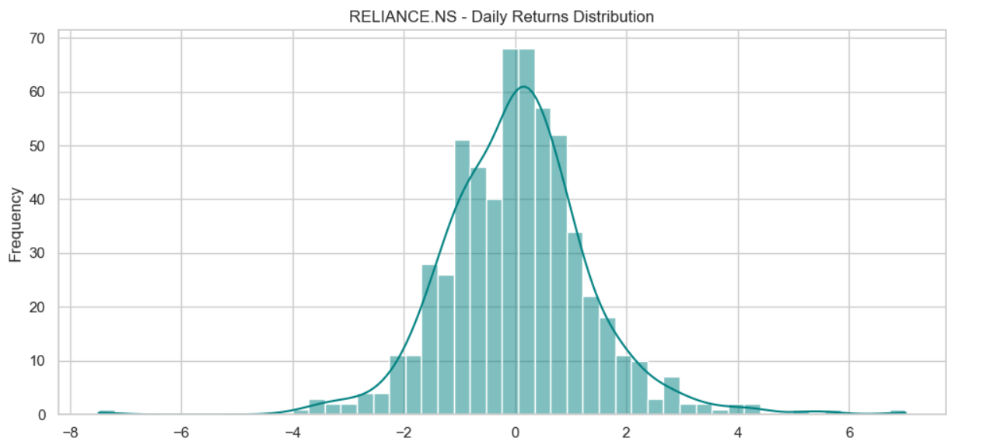
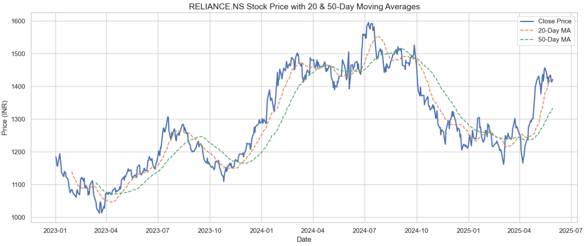
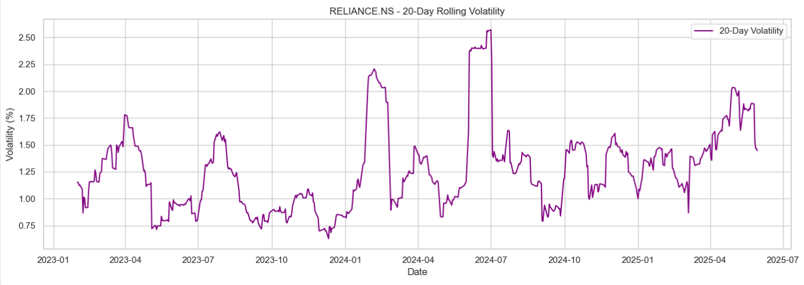
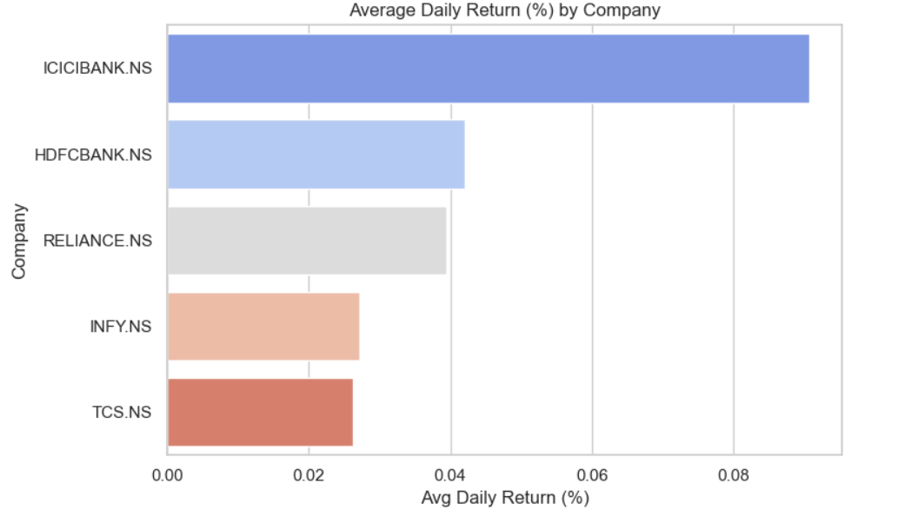

# stock-market-trend-analysis

# 📈 Stock Market Trend Analysis of Top 5 Indian Companies (2023–2025)

## 📝 Project Overview
This project focuses on analyzing the stock market trends of the top 5 Indian companies from 2023 to 2025 using Python, Pandas, and Matplotlib. The goal is to uncover patterns, identify potential risks, and visualize key metrics like daily returns, moving averages, and volatility.

## 🧠 Objectives
- To analyze historical stock prices of top Indian companies.
- To identify short-term and long-term trends using technical indicators.
- To visualize and compare performance using charts.
- To extract key insights useful for investors and stakeholders.

## 📊 Tools Used
- Python (Pandas, Matplotlib, Seaborn)
- Jupyter Notebook
- Yahoo Finance (via yfinance)
- Microsoft Word (for report)
- GitHub (for version control & sharing)

## 🧾 Dataset
- 🏢 Companies Analyzed: 
  - Reliance Industries (RELIANCE.NS)
  - Tata Consultancy Services (TCS.NS)
  - Infosys (INFY.NS)
  - HDFC Bank (HDFCBANK.NS)
  - Hindustan Unilever (HINDUNILVR.NS)

## 📉 Key Visualizations

| Chart | Description |
|-------|-------------|
|  | Shows % change in closing prices across time. |
|  | Highlights 20-day & 50-day moving averages to detect trends. |
|  | Measures daily stock fluctuations. |
|  | Compares performance between companies. |

## 📄 Report
For a complete breakdown of the methodology, insights, and observations, check the [Project Report (Word)](Stock_Market_Analysis_Report.docx).

## ✅ Outcomes
- Identified trend lines and volatility indicators.
- Understood company-wise performance for investment decisions.
- Explored visual storytelling techniques for stock analysis.

## 📌 Future Improvements
- Deploy interactive dashboards using Plotly or Power BI.
- Expand to include macroeconomic indicators.
- Predictive modeling with machine learning.

---
